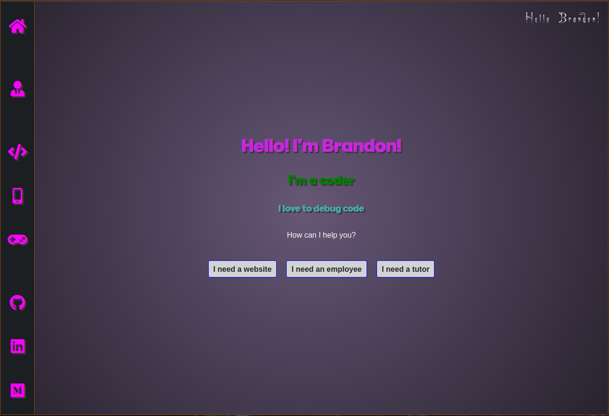

# DefoeBrand Portfolio

> This project is my personal portfolio. It was created as part of the Microverse coursework and will continue to serve as my online presence in order to showcase my talents as they develop.

### Features

-   Easy navigation via persistent left navigation bar
-   Links to contact forms based on user needs
-   Projects organized by type
-   Personal login for easy addition / editing of displayed projects
-   Responsive design for desktop or mobile use

###### Coming Features

-   Live chat
-   Color scheme changer
-   User profiles for commenting on projects, social interaction, and game save data
-   Personal Blog

## Pages

-   Home (portal)
-   About Me
-   Websites
-   Apps
-   Games
-   GitHub Profile
-   LinkedIn Profile
-   Medium Profile

## Built With

-   Ubuntu
-   Atom
-   HTML / SCSS / Bootstrap / jQuery / Ruby / Rails

## Live Demo

Click the [Live Link](https://www.defoebrand.com/) to visit this site now!

## Getting Started

To get a local copy up and running follow these simple example steps.

#### Prerequisites

Ruby: 2.7.1  
Rails: 6

#### Setup

1.  Clone this repository with `git clone` [`https://github.com/defoebrand/developer-portfolio.git`](https://github.com/defoebrand/developer-portfolio.git) using a terminal or command line.
2.  Direct your terminal to the project folder by entering `cd developer-portfolio`
3.  Run `bundle install` to install the necessary dependencies
4.  Run `rails db:setup` to setup your local database.
5.  Run `rails server` to start the application.
6.  Finally, direct your browser to '<http://localhost:3000/>' to view the app.

## Author

👤 **Brandon Defoe**

-   Github: [@defoebrand](https://github.com/defoebrand)
-   LinkedIn: [@defoebrand](https://www.linkedin.com/in/defoebrand/)
-   Gmail: <mailto:defoe.brand@gmail.com>

## Show your support

Give a ⭐️ if you like this project!

## Acknowledgments

-   Microverse
-   The Kermits

## 📝 License

This project is [MIT](lic.url) licensed.
